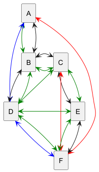

# Jade : Agents

## Voyages en ville

---

Ces codes illustrent un petit cas d'étude permettant de manipuler le protocole de ContractNet.

Un voyageur souhaite aller d'un point `a` à un point `b` :

- il lance un appel d'offre à plusieurs agences de voyages,
- certaines sont spécialisées dans les vélos, les bus, les trains ou les voitures.
- ces agences envoient leurs catalogues de voyages possibles
- le client fait son choix et peut combiner différentes offres selon ses critères (coûts, temps, émission de CO2, ...)


- Des classes sont déjà proposées :
    - La classe [AgenceAgent](https://github.com/EmmanuelADAM/jade/blob/master/voyagesEnVille/agents/AgenceAgent.java) est
      une classe représentant une agence de voyage. Une agence dispose d'un catalogue de voyages qu'elle crée à partir
      d'un fichier csv (bus.csv, car.csv ou train.csv).
    - La
      classe [TravellerAgent](https://github.com/EmmanuelADAM/jade/blob/master/voyagesEnVille/agents/TravellerAgent.java)
      représente le client, qui émet l'appel d'offres et effectue son choix *(à modifier pour le choix par durée)*, 
    - La classe [AlertAgent](https://github.com/EmmanuelADAM/jade/blob/master/voyagesEnVille/agents/AlertAgent.java)
      représente un agent capable d'émettre un appel radio (broadcast) signalant une alerte sur un tronçon de route.
    - La classe [LaunchSimu](https://github.com/EmmanuelADAM/jade/blob/master/voyagesEnVille/launch/LaunchSimu.java) lance
      un client, 3 agents agence de voyages spécialisée, et 1 agent d'alertes.
    - La
      classe [ContractNetVente](https://github.com/EmmanuelADAM/jade/blob/master/voyagesEnVille/comportements/ContractNetVente.java)
      code le comportement de réponse à un appel d'offre, il consiste simplement à envoyer le catalogue complet des
      voyages, il peut être optimisé.
    - La
      classe [ContractNetAchat](https://github.com/EmmanuelADAM/jade/blob/master/voyagesEnVille/comportements/ContractNetAchat.java)
      code le comportement de lancement et de gestion d'un appel d'offres.

- Dans le package [voyagesEnVille.data](https://github.com/EmmanuelADAM/jade/tree/master/voyagesEnVille/data) se trouvent
  les classes qui consruisent les chemins possibles.
- Dans le package [voyagesEnVille.gui](https://github.com/EmmanuelADAM/jade/tree/master/voyagesEnVille/gui) se trouvent
  les classes qui construisent les fenêtres de dialogue avec les agents.

  
Le code utilise
- la librairie opencsv
- la librairie json
- la librairie jadeUPHF.
- Ces librairies sont dans le répertoire [external-libraries](https://github.com/EmmanuelADAM/jade/tree/english/external-libraries)

-----
Le code s'exécute tel quel, mais le client ne peut effectuer qu'un choix par durée la plus courte parmi les voyages proposés.

Code pouvant etre amélioré :
- la décrémentation du nb de places par voyage : 
  - on peut poser 3 places par trajet en voiture, 20 vélos disponibles dans chaque zone, 50 places dans un bus, et 200 places dans un tram,
  - lorsqu'un voyage est choisi, le nombre de places disponibles est décrémenté,
  - si le nombre de places disponibles est nul, le voyage n'est plus proposé. 
  - cas particulier des vélos : à l'utilisation d'un vélo, le nombre de vélos dans la zone de départ est décrémenté, et il est incrémenté dans la zone d'arrivée **après la date d'arrivée (il sera rendu accessible après la date d'arrivée prévue)** 
- Prise en compte de la météo : 
  - si pluie et/ou vent très fort, les trajets à vélo ne sont pas proposés,
  - si vent fort, les trajets à vélo sont proposés avec un temps majoré de 50%,
  - si neige, les trajets en voiture sont proposés avec un temps majoré de 50% et un coût majoré de 20%.
    - **Selon la météo** de la ville, les propositions de l'agent traveller doivent être adaptées.
    - vous utiliserez l'api météo gratuite vue en TD
- proposition d'un comportement de **réaction suite à la réception d'un message d'alerte** sur un tronçon donné : 
    - pour les agences (disparition des trajets impactés),
    - pour le client (relance d'une demande de trajet si impacté, achat des billets permettant de compléter le trajet).
    - idéalement, un accès à une API de trafic routier pour avoir des alertes en temps réel est un plus ...
- ou d'autres améliorations  ...
-----

### Réseau de transport


Pour information, les trajets possibles sont les suivants :

- en véloroute (en vert dans la figure ci-dessous), entre les zones a--b, b--c, c--d, d--e, e--f
- en bus (en noir dans la figure ci-dessous), entre les zones a--b, b--c, b--d,  c--e et  e--f,
- en tram (en bleu dans la figure ci-dessous), entre les zones a--d, d--f,
- en voiture (covoiturage) (en rouge dans la figure ci-dessous), entre les zones a--f, c--f
- les coûts, vitesses, émissions de co2, confort ... dépendent du moyen utilisé, et du climat (pluie, vent, ...)


<!-- note, pour plantUml, ci-dessous retirer les espaces entre des tirets -- et le signe > 
```
@startuml trajetsV1
hide empty description
rectangle A
rectangle B
rectangle C
rectangle D
rectangle E
rectangle F
A <--[#green]> B
A <-- > B
A <-[#blue]> D
A <-[#red]> F
B <-[#green]> C
B <-> C
B <-> D
B <-[#green]> D
C <--[#green]> D
C <-> E
C <-[#green]> E
C <-[#red]> F
D <-[#green]> E
D <-[#blue]> F
D <-[#green]> F
E <--[#green]> F
E <-- > F


@enduml 
```

-->




---

